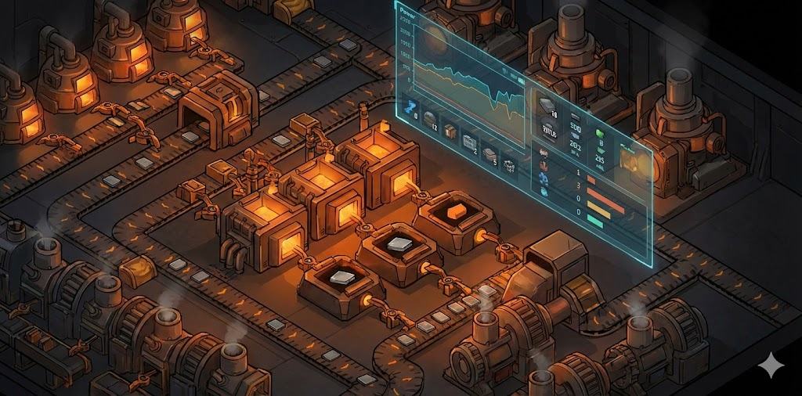
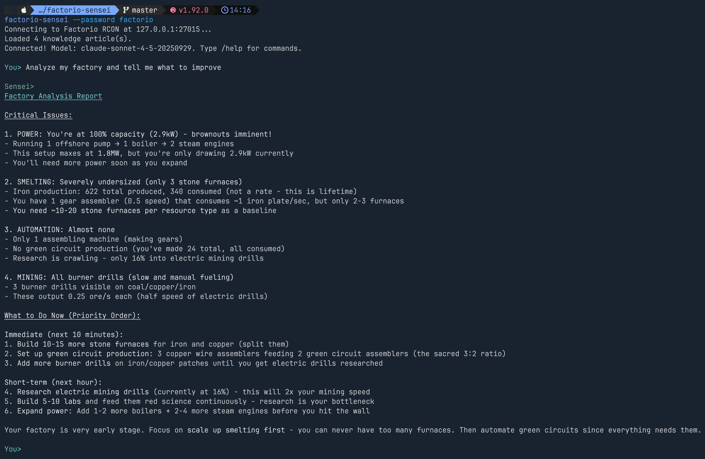
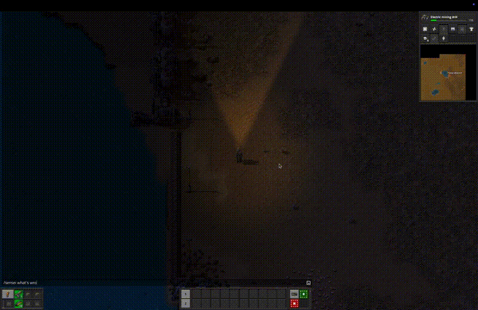

# Factorio Sensei

**AI coaching copilot for Factorio 2.x** — connects to your live game and gives real-time advice.

Sensei connects to your running Factorio game via RCON, reads your actual game state, and gives personalized coaching advice powered by Claude. It's not a generic chatbot — it sees your factory. Your inventory, production rates, power grid, research queue, nearby resources, assembler setups — Sensei reads it all and coaches you based on what's actually happening in your game.

No copy-pasting screenshots into ChatGPT. No explaining your setup in a separate window. Sensei sees your game state directly — just ask a question and get advice based on what's actually in front of you.

**What Sensei can see:**

- Player position and current surface
- Full inventory with item counts
- Production and consumption rates for any item
- Power grid stats — generation, consumption, satisfaction
- Current research, progress %, and queue
- Nearby buildings, belts, inserters (configurable radius)
- Nearby ore patches and oil fields
- Assembler recipes, crafting speeds, and modules
- Furnace recipes, fuel types, and outputs
- Any recipe's ingredients, products, and crafting time

## Two Ways to Play

### Terminal REPL

Run `factorio-sensei` and chat in your terminal. Ask questions, get advice with full markdown formatting and color.

```
You> How's my power situation?

Sensei> Let me check your power grid.
[calls get_power_stats]

Your power grid is in trouble — you're generating 5.4 MW but consuming 7.1 MW,
giving you only 76% satisfaction. You need at least 2 more steam engines to
cover the deficit. Each steam engine produces 900 kW, so 3 would give you
comfortable headroom.
```

Built-in commands:
- `/status` — quick overview of position, power, research, production
- `/help` — show available commands
- `/clear` — clear conversation history
- `/quit` — exit



### In-Game Chat (`/sensei`)

Type `/sensei <question>` directly in Factorio's chat console. Responses appear in-game as green `[Sensei]` messages — no alt-tabbing required.

Requires the bundled Lua mod (installed with one command) and the `--bridge` flag:

```bash
factorio-sensei install-mod    # one-time setup
factorio-sensei --password <rcon-pass> --bridge
```



## Quick Start

### Prerequisites

- **Factorio 2.x** running as a multiplayer host (Multiplayer > Host New Game / Load)
- **RCON enabled** in Factorio's config (see [RCON Setup](#factorio-rcon-setup) below)
- **Anthropic API key** — get one at [console.anthropic.com](https://console.anthropic.com/settings/keys)
- **Rust toolchain** — for `cargo install` ([rustup.rs](https://rustup.rs))

> Currently supports Anthropic (Claude) models only. Default model: `claude-sonnet-4-5-20250929`. Override with `--model` or `FACTORIO_MODEL` env var.

### Option A: Install from crates.io (recommended)

```bash
cargo install factorio-sensei
export ANTHROPIC_API_KEY=sk-ant-...
factorio-sensei --password <your-rcon-password>
```

For in-game `/sensei` command:

```bash
factorio-sensei install-mod
# Restart Factorio, enable "Factorio Sensei" mod in your save, then:
factorio-sensei --password <your-rcon-password> --bridge
```

### Option B: Build from source

```bash
git clone https://github.com/alloc33/factorio-sensei
cd factorio-sensei
cargo build --release
./target/release/factorio-sensei --password <your-rcon-password>
```

To install the mod manually, copy the mod directory:

```bash
# macOS
cp -r factorio-mod ~/Library/Application\ Support/factorio/mods/factorio-sensei_0.1.0

# Linux
cp -r factorio-mod ~/.factorio/mods/factorio-sensei_0.1.0

# Windows
xcopy factorio-mod "%APPDATA%\Factorio\mods\factorio-sensei_0.1.0" /E /I
```

### Factorio RCON Setup

RCON lets external programs communicate with Factorio. You must enable it in your config file.

**Config file location:**

| Platform | Path |
|----------|------|
| macOS | `~/Library/Application Support/factorio/config/config.ini` |
| Linux | `~/.factorio/config/config.ini` |
| Windows | `%APPDATA%\Factorio\config\config.ini` |

**Add or edit these lines:**

```ini
; use-local-rcon=true
local-rcon-socket=127.0.0.1:27015
local-rcon-password=your-password-here
```

**Important:** You must host the game via **Multiplayer > Host New Game** (or Host Saved Game) for RCON to be active. Single-player mode does not enable RCON.

### Configuration

| Flag | Env Var | Default | Description |
|------|---------|---------|-------------|
| `--addr` | `FACTORIO_RCON_ADDR` | `127.0.0.1:27015` | RCON address (host:port) |
| `--password` | `FACTORIO_RCON_PASS` | `factorio` | RCON password |
| `--model` | `FACTORIO_MODEL` | `claude-sonnet-4-5-20250929` | Claude model to use |
| `--bridge` | `FACTORIO_BRIDGE` | `false` | Enable in-game chat bridge |

You can also set these in a `.env` file in the working directory.

The `ANTHROPIC_API_KEY` environment variable is required and has no CLI flag.

## How It Works

```
┌─────────────┐     RCON      ┌──────────────────┐   Anthropic API   ┌─────────┐
│  Factorio   │◄────────────► │  factorio-sensei │◄────────────────► │  Claude │
│   (2.x)     │               │  (10 game tools) │                   │  (LLM)  │
└─────────────┘               └──────────────────┘                   └─────────┘
       ▲                       │              │
       │  /sensei command      │              │  Embedded knowledge base
       └── Lua mod ────────────┘              │  (mechanics, ratios, formulas)
           (optional)                         └─────────────────────────────
```

- **Read-only** — Sensei observes and advises, never executes game actions
- **10 specialized tools** query game state via RCON by executing Lua on the Factorio runtime
- **Built-in knowledge base** with exact Factorio 2.x ratios, belt throughputs, inserter speeds, power formulas, and crafting math
- **Conversation memory** within a session — Sensei remembers what you discussed
- Built with [Rig](https://github.com/0xPlaygrounds/rig) (Rust LLM framework) + [`factorio-rcon`](https://github.com/alloc33/factorio-rcon)

## Game State Tools

| Tool | What it reads |
|------|--------------|
| Player Position | x/y coordinates and current surface |
| Player Inventory | All items and counts in main inventory |
| Production Stats | Total produced/consumed for any item |
| Power Stats | Generation, consumption, satisfaction ratio |
| Research Status | Current research, progress %, queue |
| Nearby Entities | Machines, belts, inserters within radius |
| Nearby Resources | Ore patches, oil fields within radius |
| Assemblers | Recipes, crafting speeds, module bonuses |
| Furnaces | Recipes, fuel type, output items |
| Recipe Lookup | Ingredients, products, crafting time |

## Troubleshooting

**"Connection refused"**
RCON is not active. Make sure you've enabled RCON in `config.ini` and are hosting via **Multiplayer > Host New Game** (not single-player).

**"ANTHROPIC_API_KEY not set"**
Export your API key: `export ANTHROPIC_API_KEY=sk-ant-...` or add it to a `.env` file.

**Mod not showing in Factorio**
The mod directory must be named exactly `factorio-sensei_0.1.0`. Use `factorio-sensei install-mod` for automatic installation.

**In-game bridge not responding**
Make sure you started with the `--bridge` flag and that the mod is enabled in your current save (check Mods menu in-game).

**Using `/c` commands disables achievements**
This is a Factorio limitation. Sensei's tools execute Lua via RCON (`/c` commands), which disables achievements for that save file.

## License

MIT

## Credits

- Built with [Rig](https://github.com/0xPlaygrounds/rig) — Rust LLM agent framework
- Powered by [Claude](https://www.anthropic.com/claude) from Anthropic
- RCON client: [`factorio-rcon`](https://github.com/alloc33/factorio-rcon)
